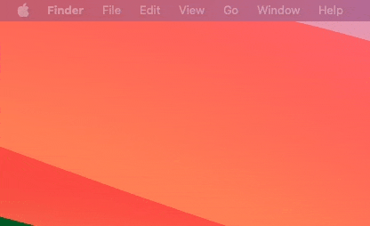

# neko-swiftui
A modern implementation of Neko in SwiftUI

Some added bonus features for a better user experience:

- Menubar item with various options
- Support multiple monitors
- Launch at login functionality
- Temporary hide Neko

## Demo

## Acknowledgements

This work is inspired by other implementations of Neko:

- https://github.com/IreneKnapp/oneko
- https://github.com/mdonoughe/neko-mac
- https://github.com/Lontronix/Neko-Swift
